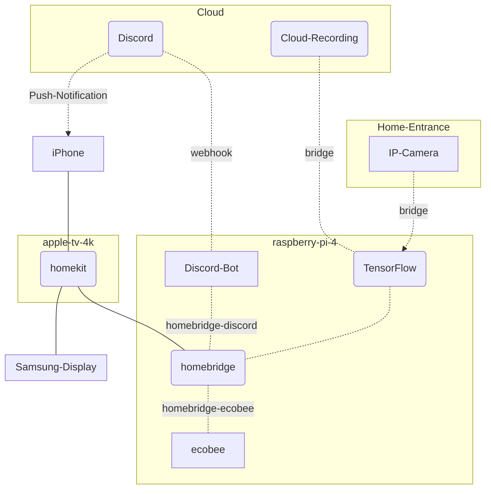
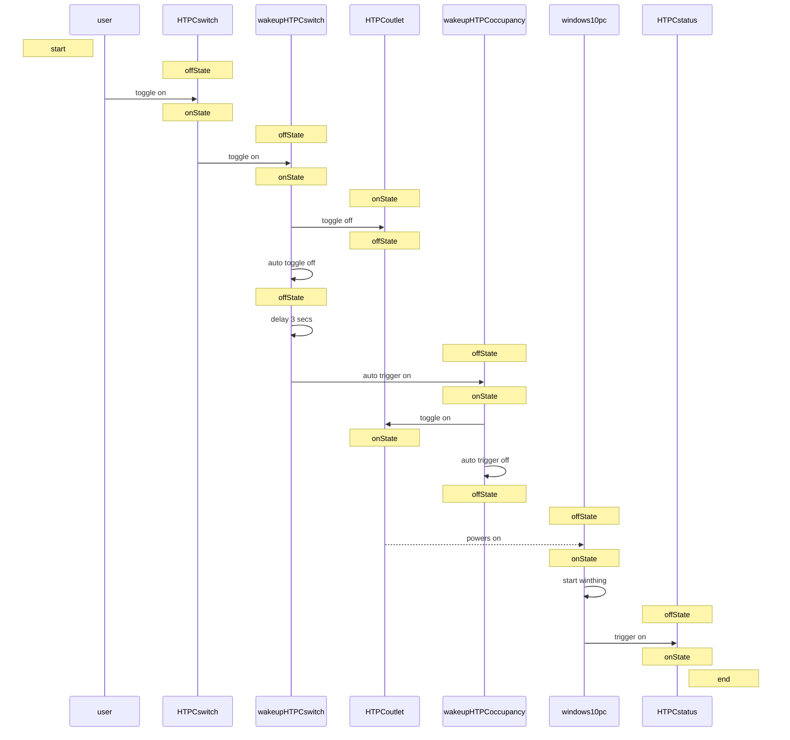
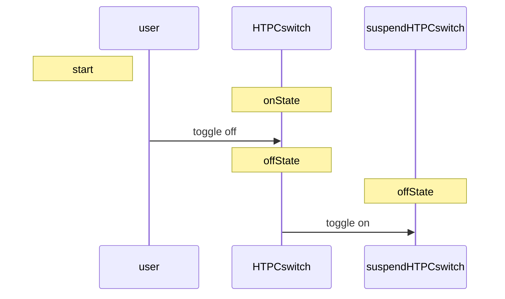

# Block Diagram

```mermaid
graph TD;
   homekit(homekit);
   homebridge(homebridge);
   TensorFlow(TensorFlow);
   Discord(Discord);
   Cloud-Recording(Cloud-Recording);
   IP-Camera[IP-Camera];
   iPhone[iPhone];
   subgraph Home-Entrance
   IP-Camera;
   end
   subgraph raspberry-pi-4
   TensorFlow .-homebridge;
   Discord-Bot-. homebridge-discord .-homebridge;
   homebridge-. homebridge-ecobee .-ecobee;
   end
   IP-Camera-. bridge .->TensorFlow;
   Cloud-Recording-. bridge .-TensorFlow;
   Discord-. webhook .-Discord-Bot;
   Discord-. Push-Notification .->iPhone;
   iPhone---homekit;
   homekit---homebridge;
   subgraph Cloud
   Cloud-Recording;
   Discord;
   end
   subgraph apple-tv-4k
   homekit;
   end
   subgraph Samsung-Display
   end
   homekit---Samsung-Display;
```

# Sequence Diagram

```mermaid
sequenceDiagram
   Note left of user: start
   Note over HTPCswitch: offState
   user->>HTPCswitch: toggle on
   Note over HTPCswitch: onState
   Note over wakeupHTPCswitch: offState
   HTPCswitch->>wakeupHTPCswitch: toggle on
   Note over wakeupHTPCswitch: onState
   Note over HTPCoutlet: onState
   wakeupHTPCswitch->>HTPCoutlet: toggle off
   Note over HTPCoutlet: offState
   wakeupHTPCswitch->>wakeupHTPCswitch: auto toggle off
   Note over wakeupHTPCswitch: offState
   wakeupHTPCswitch->>wakeupHTPCswitch: delay 3 secs
   Note over wakeupHTPCoccupancy: offState
   wakeupHTPCswitch->>wakeupHTPCoccupancy: auto trigger on
   Note over wakeupHTPCoccupancy: onState
   wakeupHTPCoccupancy->>HTPCoutlet: toggle on
   Note over HTPCoutlet: onState
   wakeupHTPCoccupancy->>wakeupHTPCoccupancy: auto trigger off
   Note over wakeupHTPCoccupancy: offState
   Note over windows10pc: offState
   HTPCoutlet-->>windows10pc: powers on
   Note over windows10pc: onState
   windows10pc->>windows10pc: start winthing
   Note over HTPCstatus: offState
   windows10pc->>HTPCstatus: trigger on
   Note over HTPCstatus: onState
   Note right of HTPCstatus: end


```

```mermaid
sequenceDiagram
   Note left of user: start
   Note over HTPCswitch: onState
   user->>HTPCswitch: toggle off
   Note over HTPCswitch: offState
   Note over suspendHTPCswitch: offState
   HTPCswitch->>suspendHTPCswitch: toggle on
```

