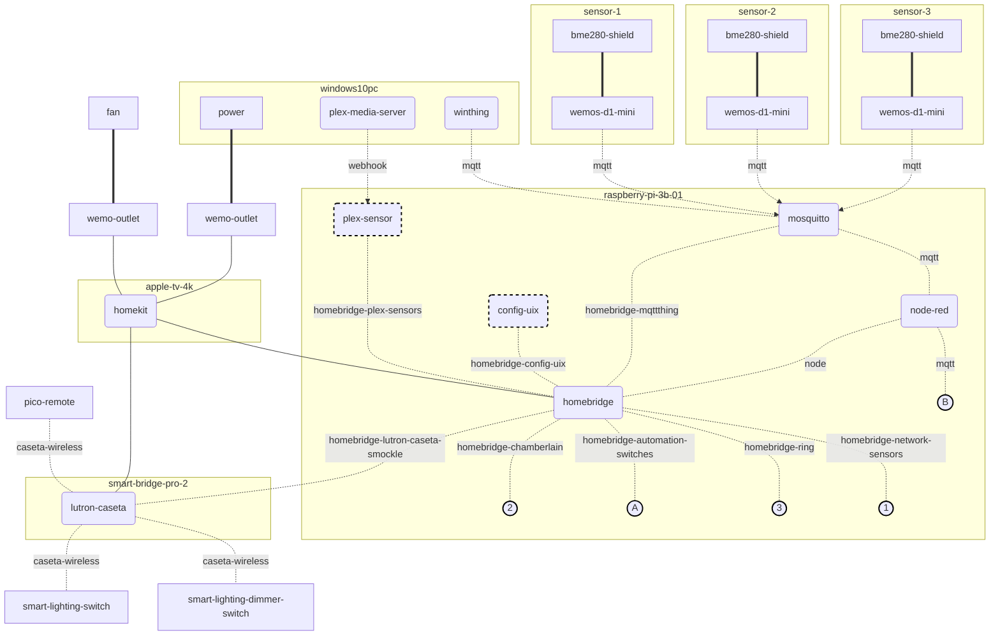
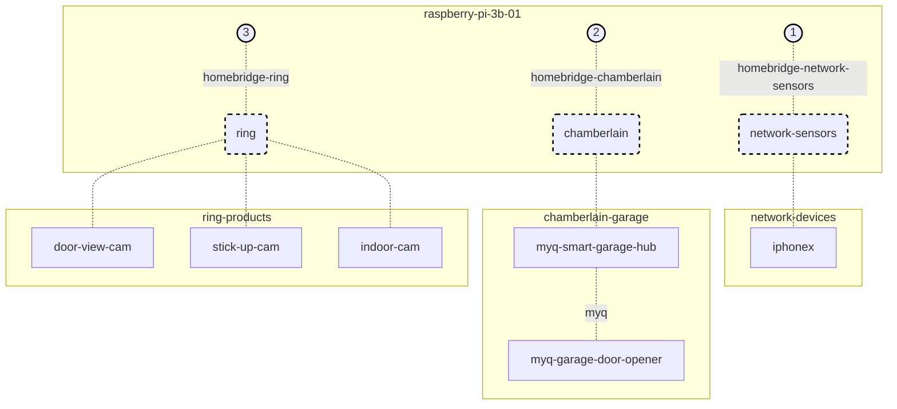
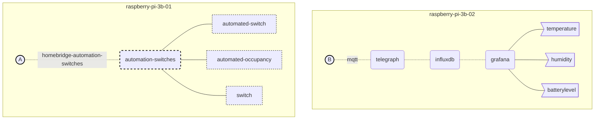
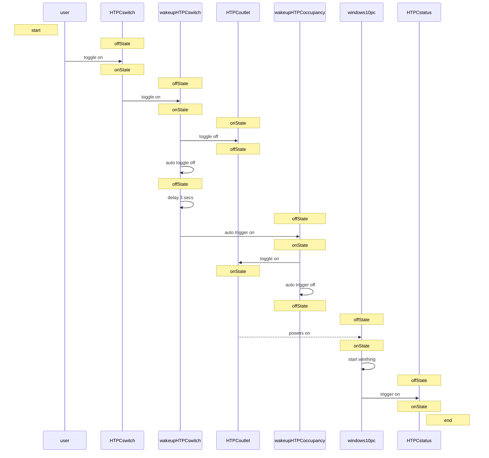
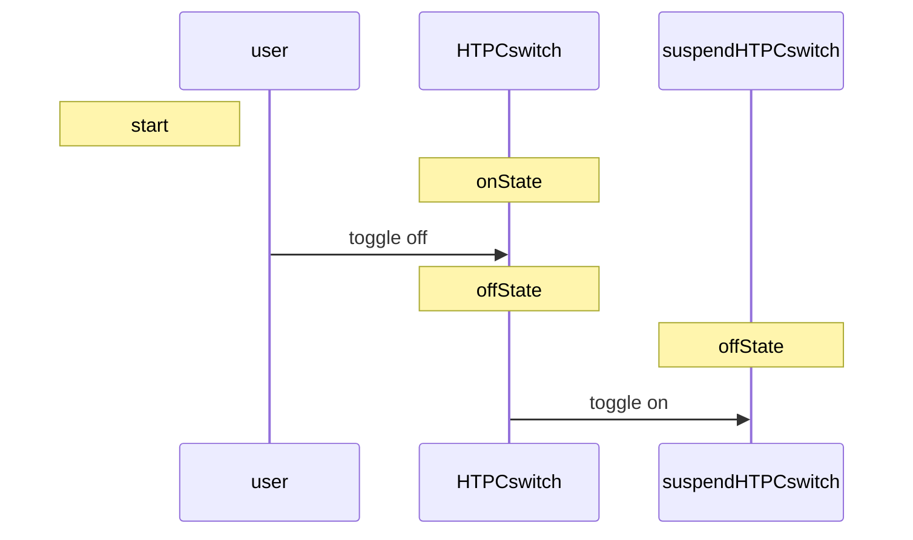

# Block Diagram

```mermaid
graph TD;
   homekit(homekit);
   homebridge(homebridge);
   mosquitto(mosquitto);
   node-red(node-red);
   lutron-caseta(lutron-caseta);
   pms(plex-media-server);
   winthing(winthing);

   bme280-01[bme280-shield];
   wemos-01[wemos-d1-mini];
   bme280-02[bme280-shield];
   wemos-02[wemos-d1-mini];
   bme280-03[bme280-shield];
   wemos-03[wemos-d1-mini];
   power-htpc[power];
   wemo-outlet-htpc[wemo-outlet];
   wemo-outlet-fan[wemo-outlet];

   plex-sensor(plex-sensor);
   style plex-sensor stroke:#000,stroke-width:2px,stroke-dasharray: 5,5;
   config-uix(config-uix);
   style config-uix stroke:#000,stroke-width:2px,stroke-dasharray: 5,5;

   chamberlain-connector((2));
   style chamberlain-connector stroke:#000,stroke-width:2px;
   automation-switches-connector((A));
   style automation-switches-connector stroke:#000,stroke-width:2px;
   ring-connector((3));
   style ring-connector stroke:#000,stroke-width:2px;
   network-sensors-connector((1));
   style network-sensors-connector stroke:#000,stroke-width:2px;
   tig-connector((B));
   style tig-connector stroke:#000,stroke-width:2px;

   subgraph sensor-1
   bme280-01===wemos-01;
   end

   subgraph sensor-2
   bme280-02===wemos-02;
   end

   subgraph sensor-3
   bme280-03===wemos-03;
   end
   
   subgraph raspberry-pi-3b-01
   mosquitto-. mqtt .-node-red;
   node-red-. node .- homebridge;
   node-red-. mqtt .-tig-connector;
   mosquitto-. homebridge-mqttthing .-homebridge;
   config-uix-. homebridge-config-uix .-homebridge;
   plex-sensor-. homebridge-plex-sensors .-homebridge;
   homebridge-. homebridge-network-sensors .-network-sensors-connector;
   homebridge-. homebridge-automation-switches .-automation-switches-connector;
   homebridge-. homebridge-chamberlain .-chamberlain-connector;
   homebridge-. homebridge-ring .-ring-connector;
   end

   wemos-03-. mqtt .->mosquitto;
   wemos-02-. mqtt .->mosquitto;
   wemos-01-. mqtt .->mosquitto;

   winthing-. mqtt .-mosquitto;
   pms-. webhook .->plex-sensor; 

   power-htpc===wemo-outlet-htpc;
   wemo-outlet-htpc---homekit;
   fan===wemo-outlet-fan;
   wemo-outlet-fan---homekit;
   homekit---homebridge;

   subgraph windows10pc
   winthing;
   pms;
   power-htpc;
   end

   subgraph apple-tv-4k
   homekit;
   end

   subgraph smart-bridge-pro-2
   lutron-caseta;
   end

   homekit---lutron-caseta;
   homebridge-. homebridge-lutron-caseta-smockle .-lutron-caseta;
   lutron-caseta-. caseta-wireless .-smart-lighting-switch;
   lutron-caseta-. caseta-wireless .-smart-lighting-dimmer-switch;
   pico-remote-. caseta-wireless .-lutron-caseta;


```

```mermaid
graph TD
   chamberlain-connector((2));
   style chamberlain-connector stroke:#000,stroke-width:2px;
   ring-connector((3));
   style ring-connector stroke:#000,stroke-width:2px;
   network-sensors-connector((1));
   style network-sensors-connector stroke:#000,stroke-width:2px;

   network-sensors(network-sensors);
   style network-sensors stroke:#000,stroke-width:2px,stroke-dasharray: 5,5;
   chamberlain(chamberlain);
   style chamberlain stroke:#000,stroke-width:2px,stroke-dasharray: 5,5;
   ring(ring);
   style ring stroke:#000,stroke-width:2px,stroke-dasharray: 5,5;

   subgraph network-devices
   iphonex;
   end
   
   subgraph chamberlain-garage
   myq-smart-garage-hub;
   myq-garage-door-opener;
   myq-smart-garage-hub-. myq .- myq-garage-door-opener;
   end
   
   subgraph ring-products
   door-view-cam;
   stick-up-cam;
   indoor-cam;
   end
 
   subgraph raspberry-pi-3b-01
   network-sensors-connector-. homebridge-network-sensors .-network-sensors;
   chamberlain-connector-. homebridge-chamberlain .-chamberlain;
   ring-connector-. homebridge-ring .-ring;
   network-sensors-.-iphonex;
   chamberlain-.-myq-smart-garage-hub;
   ring-.-door-view-cam;
   ring-.-stick-up-cam;
   ring-.-indoor-cam;
   end

```

```mermaid
graph TD
   automation-switches-connector((A));
   style automation-switches-connector stroke:#000,stroke-width:2px;
   tig-connector((B));
   style tig-connector stroke:#000,stroke-width:2px;

   telegraph(telegraph);
   influxdb(influxdb);
   grafana(grafana);

   subgraph raspberry-pi-3b-02
   tig-connector-. mqtt .-telegraph;
   telegraph-.-influxdb;
   influxdb-.-grafana;
   grafana---temperature>temperature];
   grafana---humidity>humidity];
   grafana---batterylevel>batterylevel];
   end  
   
   automation-switches(automation-switches);
   style automation-switches stroke:#000,stroke-width:2px,stroke-dasharray: 5,5;

   automated-switch[automated-switch];
   style automated-switch stroke:#000,stroke-width:1px,stroke-dasharray: 3,7;
   automated-occupancy[automated-occupancy];
   style automated-occupancy stroke:#000,stroke-width:1px,stroke-dasharray: 3,7;
   switch[switch];
   style switch stroke:#000,stroke-width:1px,stroke-dasharray: 3,7;

   subgraph raspberry-pi-3b-01
   automation-switches-connector-. homebridge-automation-switches .-automation-switches;
   automation-switches---automated-switch;
   automation-switches---automated-occupancy;
   automation-switches---switch;
   end


```

```mermaid
sequenceDiagram
   Note left of user: start
   Note over HTPCswitch: offState
   user->>HTPCswitch: toggle on
   Note over HTPCswitch: onState
   Note over wakeupHTPCswitch: offState
   HTPCswitch->>wakeupHTPCswitch: toggle on
   Note over wakeupHTPCswitch: onState
   Note over HTPCoutlet: onState
   wakeupHTPCswitch->>HTPCoutlet: toggle off
   Note over HTPCoutlet: offState
   wakeupHTPCswitch->>wakeupHTPCswitch: auto toggle off
   Note over wakeupHTPCswitch: offState
   wakeupHTPCswitch->>wakeupHTPCswitch: delay 3 secs
   Note over wakeupHTPCoccupancy: offState
   wakeupHTPCswitch->>wakeupHTPCoccupancy: auto trigger on
   Note over wakeupHTPCoccupancy: onState
   wakeupHTPCoccupancy->>HTPCoutlet: toggle on
   Note over HTPCoutlet: onState
   wakeupHTPCoccupancy->>wakeupHTPCoccupancy: auto trigger off
   Note over wakeupHTPCoccupancy: offState
   Note over windows10pc: offState
   HTPCoutlet-->>windows10pc: powers on
   Note over windows10pc: onState
   windows10pc->>windows10pc: start winthing
   Note over HTPCstatus: offState
   windows10pc->>HTPCstatus: trigger on
   Note over HTPCstatus: onState
   Note right of HTPCstatus: end


```

```mermaid
sequenceDiagram
   Note left of user: start
   Note over HTPCswitch: onState
   user->>HTPCswitch: toggle off
   Note over HTPCswitch: offState
   Note over suspendHTPCswitch: offState
   HTPCswitch->>suspendHTPCswitch: toggle on
```

